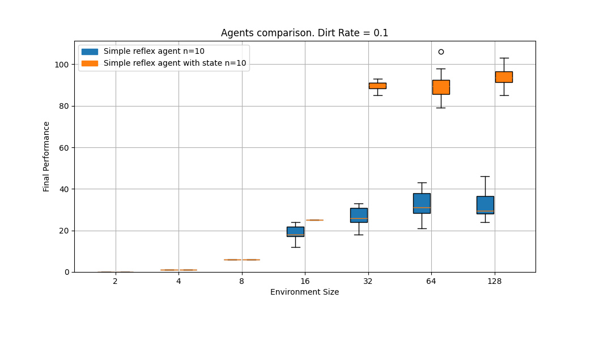
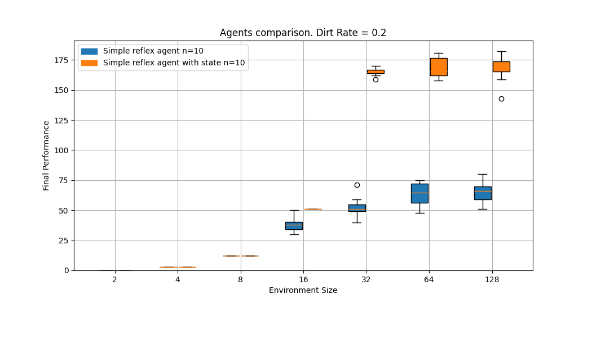
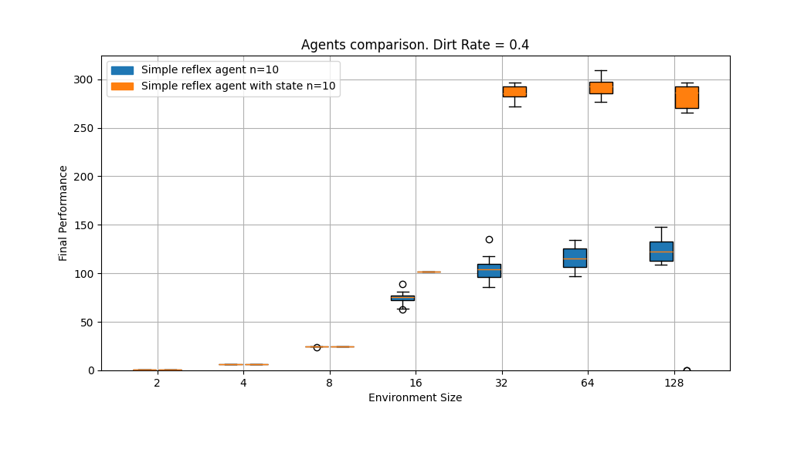
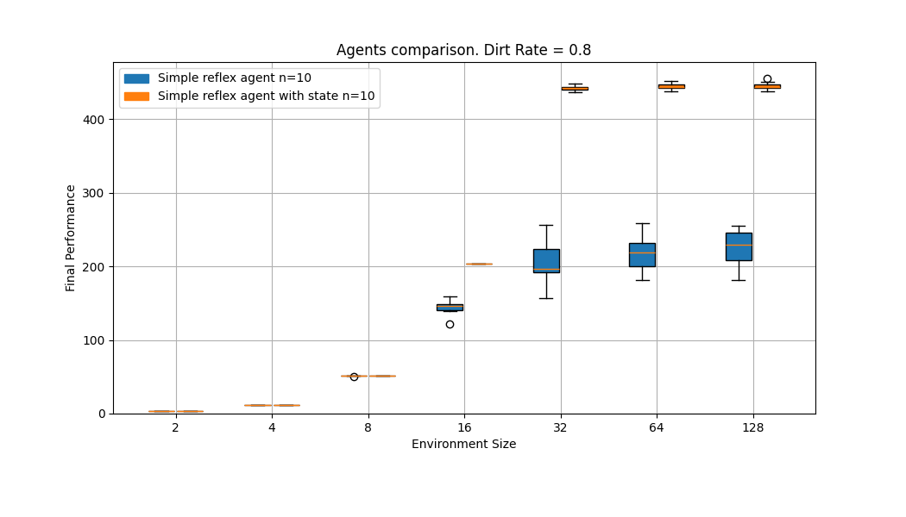

# Evaluación de Desempeño

## Experimento

Consiste en contar la cantidad de grillas limpiadas por dos tipos de agentes del mundo de la aspiradora en distintas instancias con todas las combinaciones de grillas cuadradas de tamaño 2, 4, 8, 16, 32, 64 y 128 y tasas de suciedad de 0.1, 0.2, 0.4 y 0.8. Se hicieron 10 ejecuciones con las mismas 10 semillas para cada entorno.

## Agentes

### Agente reflexivo simple
Realiza acciones dependiendo de la percepción actual del entorno

### Agente reflexivo con estado
Posee un modelo del entorno que actualiza con cada percepción. Realiza acciones dependiendo del modelo y la percepción actual del entorno.

## Resultados

A continuación se muestran resumidos los resultados. Cada gráfico corresponde a una tasa de suciedad, con las grillas limpiadas en el eje vertical y el tamaño del entorno en el eje horizontal.

### Tasa de suciedad 0.1

### Tasa de suciedad 0.2

### Tasa de suciedad 0.4

### Tasa de suciedad 0.8

## Análisis de resultados

- Poseer un modelo no ofrece ninguna ventaja para los entornos mas pequeños (2, 4 y 8)
- El agente con estado obtiene mejor desempeño en general más de dos veces las celdas limpiadas.
- El agente reflexivo simple al no tener un modelo que le ayude a determinar la mejor acción se apoya en la aleatoriedad, lo que hace que la distribución de desempeño sea más dispersa.