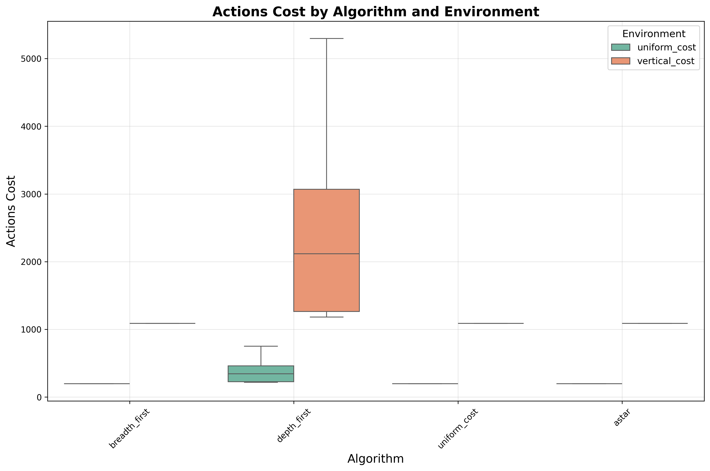
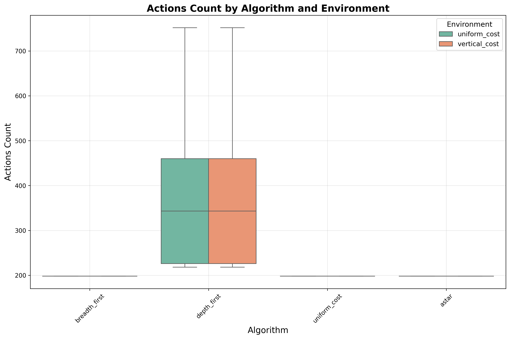
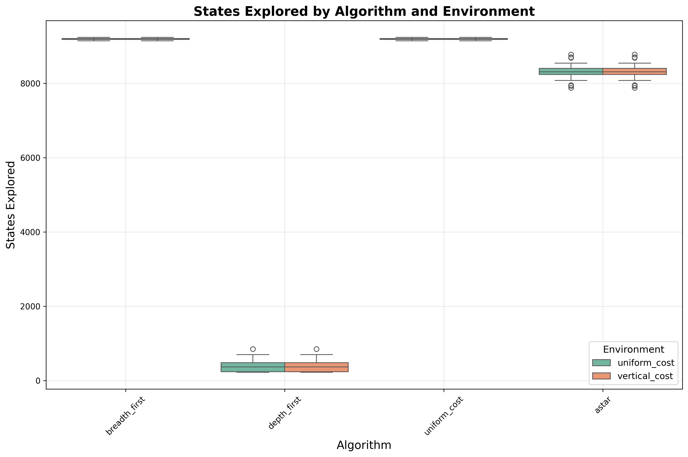
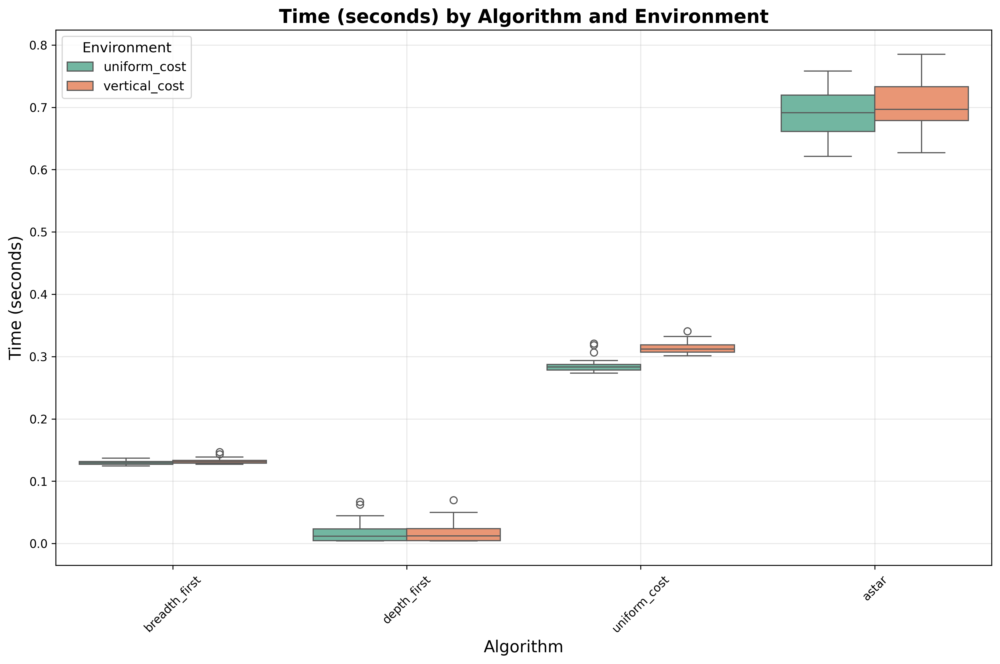

# Evaluación del desempeño de algoritmos de búsqueda

En este experimento se utiliza el entorno **`FrozenLake`** de la librería **`gymnasium`**, configurado como un escenario **determinista de 100 × 100 celdas**. Cada celda tiene una probabilidad de **0.92 de ser transitable (Frozen)** y **0.08 de representar un obstáculo (Hole)**. El agente inicia en la celda **(0, 0)** y debe encontrar el **camino más corto hasta la celda (99, 99)**.

Se evalúa el desempeño de distintos **algoritmos de búsqueda** en **30 escenarios aleatorios**, considerando **dos modalidades de costo por acción**:

* **Uniform Cost:** todas las acciones tienen un costo igual a 1.
* **Vertical Cost:** los movimientos horizontales tienen un costo de 1 y los movimientos verticales, un costo de 10.

Los algoritmos evaluados son:

* **Breadth-First Search (BFS)**
* **Depth-First Search (DFS)**
* **Uniform Cost Search (UCS)**
* **A* Search**

Para cada combinación de entorno y algoritmo se registran las siguientes métricas de desempeño:

* **Cantidad de estados explorados** hasta alcanzar el objetivo (si fue posible).
* **Número de acciones** ejecutadas en la solución encontrada.
* **Costo total** de las acciones tomadas.
* **Tiempo de ejecución** (en segundos).

Se observa que, para este entorno, todos los algoritmos excepto **DFS** logran encontrar una **solución óptima**.
Esto es esperable para **UCS** y **A*** (al utilizar una heurística admisible), pero no necesariamente para **BFS** en el entorno **Vertical Cost**. Sin embargo, dado que cualquier ruta válida requiere el mismo número de movimientos en cada dirección, las diferencias en el costo no influyen en el resultado: no es posible evitar realizar esos movimientos.

En cuanto a la cantidad de **estados explorados**, **A*** muestra una ventaja sobre **BFS** y **UCS**. No obstante, debido a que la implementación de **UCS** y **A*** utiliza una **cola de prioridad (priority queue)** con operaciones de *lookup* y *delete* en **O(n)**, **BFS** presenta un **tiempo de ejecución menor**, siendo el más rápido el obtenido por **DFS**.
