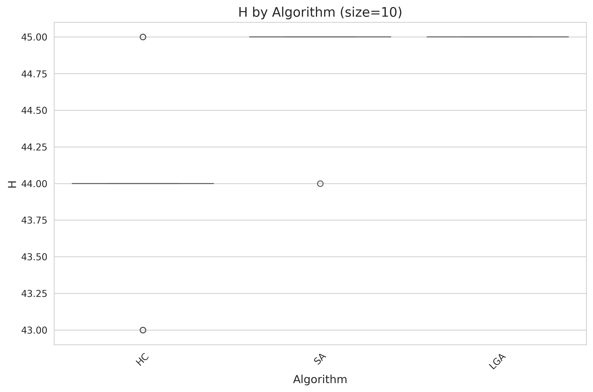
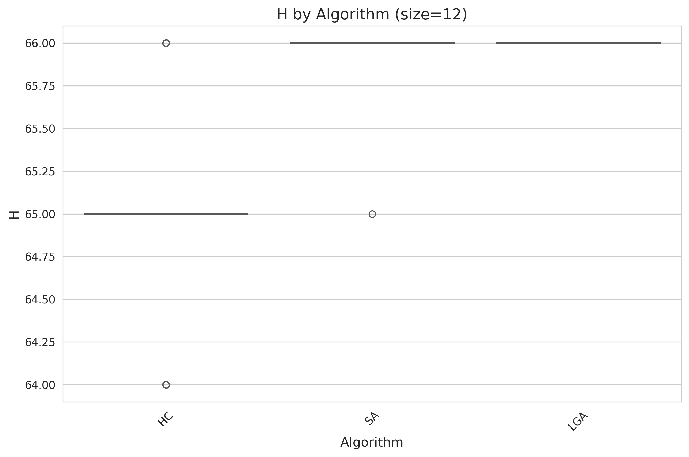
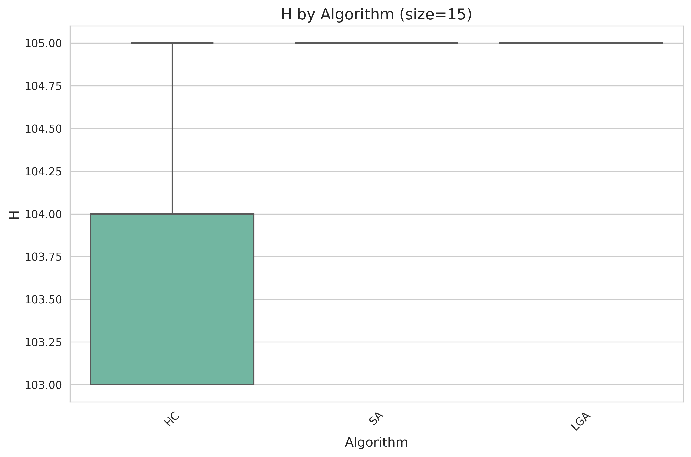
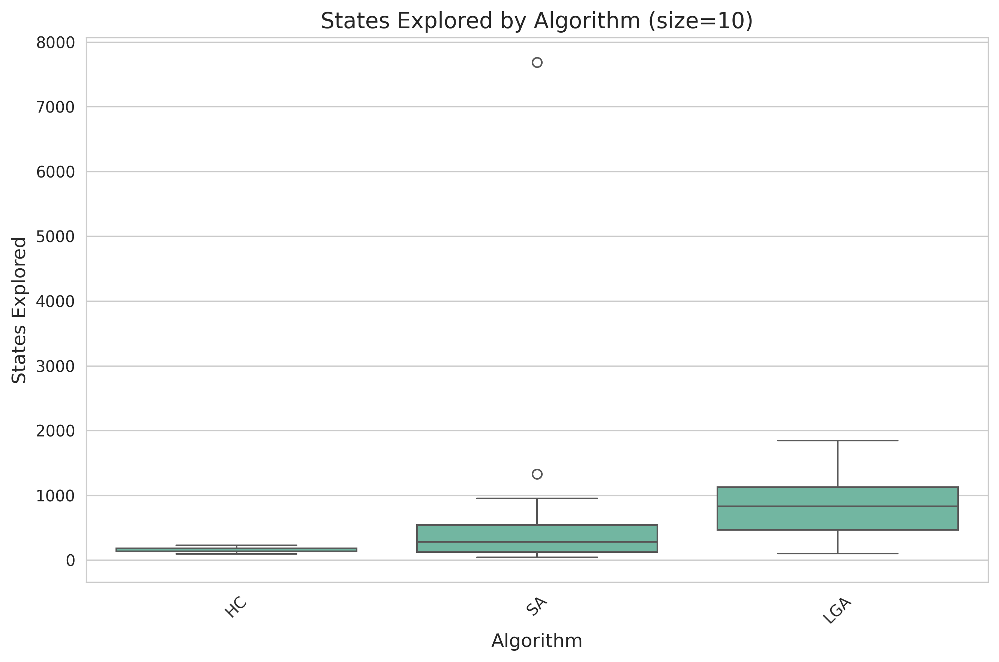
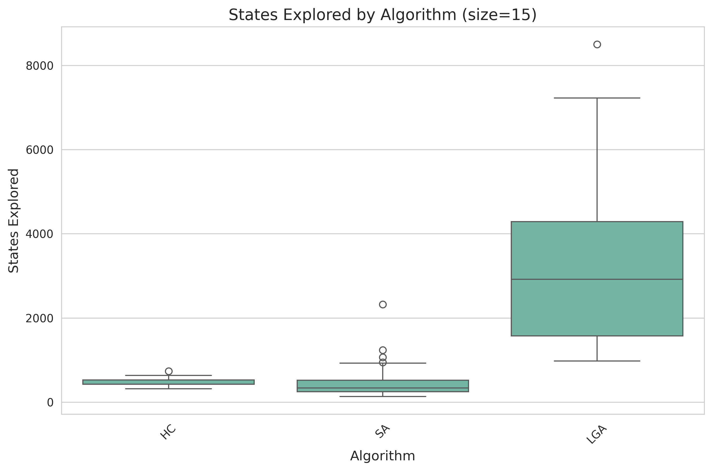
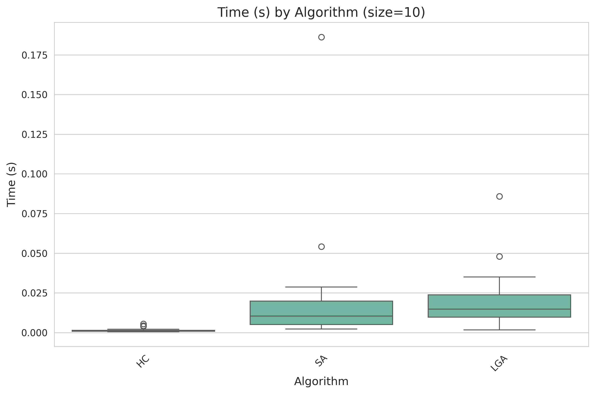
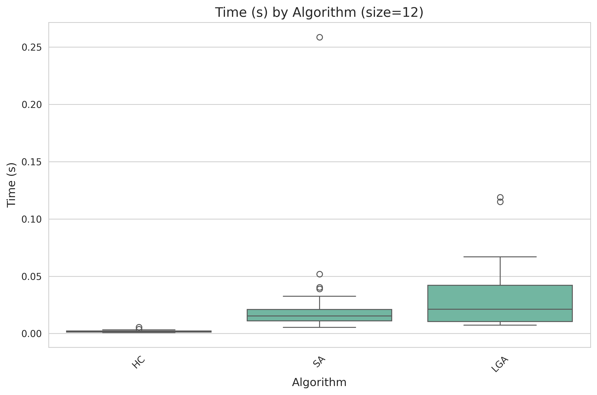
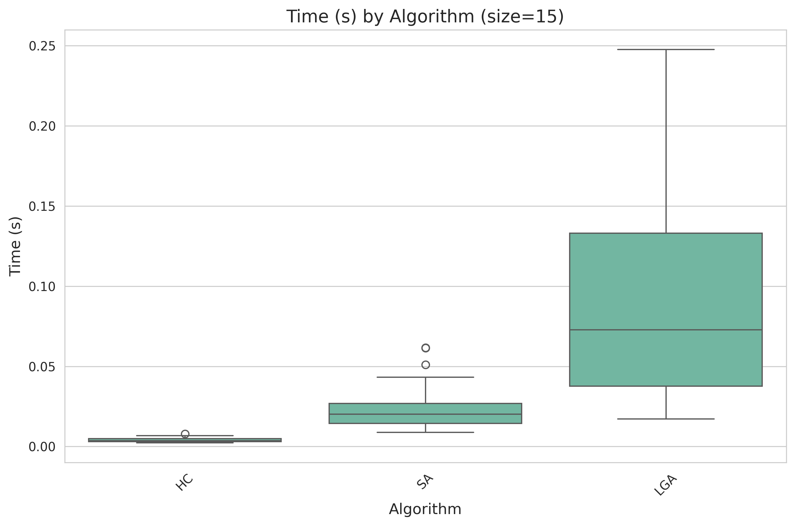
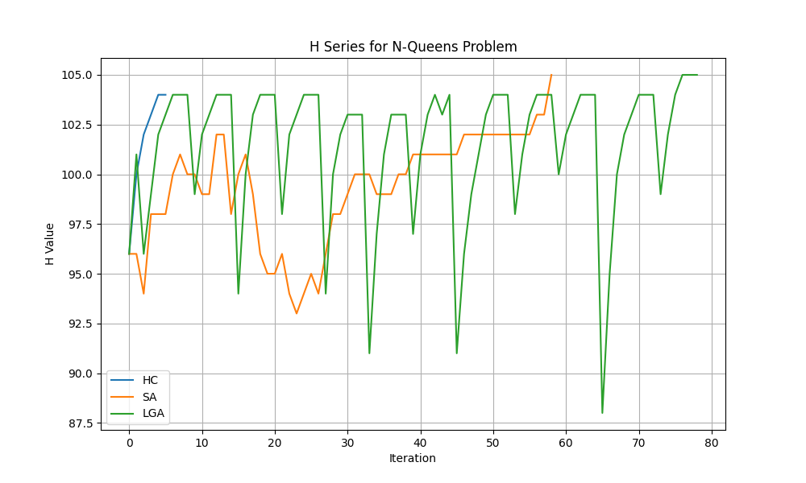
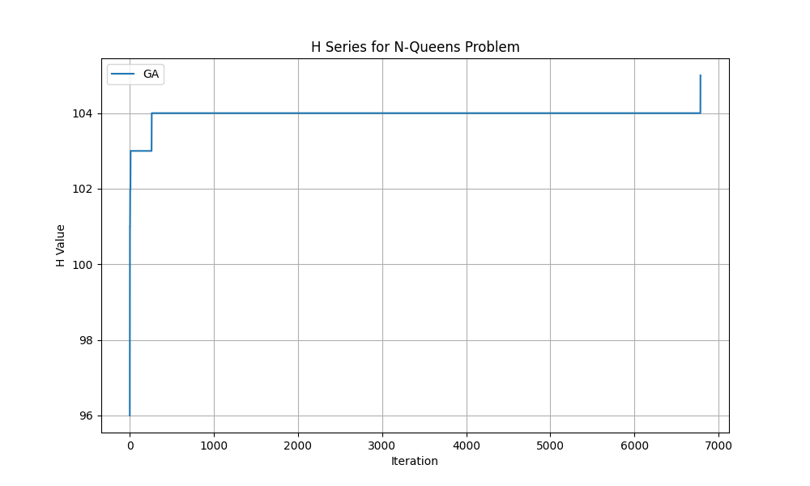

# Evaluación de Desempeño: Resolución del Problema de las N-Reinas

## 1. Introducción

El objetivo de esta evaluación es comparar el desempeño de diferentes algoritmos de búsqueda y optimización aplicados al problema de las **N-reinas**, donde se busca colocar N reinas en un tablero de N×N de manera que ninguna se amenace entre sí.

Se evaluaron cuatro algoritmos:

1. **Hill Climbing (HC)**: Algoritmo clásico de ascenso de colina, donde en cada paso se selecciona la mejor solución vecina.
2. **Simulated Annealing (SA)**: Algoritmo de enfriamiento simulado con **schedule exponencial**, parámetros `k=N`, `lambda=1/N`, y sin límite de iteraciones.
3. **Genetic Algorithm (GA)**: Algoritmo genético estándar con:

   - Operador de **order crossover**
   - Mutación por **swap** con probabilidad 0.2
   - Elitismo, preservando el individuo más apto
   - Sin límite de generaciones
   - Condición de parada es la solución óptima

4. **Lamarckian Genetic Algorithm (LGA)**: Variante del GA donde, tras crossover y mutación, se selecciona un individuo al azar y se le aplica **Hill Climbing** para mejorar su aptitud.

El propósito de la inclusión de LGA fue compensar el pobre desempeño del GA estándar y permitir una comparación más realista con HC y SA.

## 2. Metodología

### 2.1 Representación del problema

Cada tablero se representa mediante un **arreglo de tamaño N**, donde cada posición indica una columna y el valor corresponde a la fila donde se encuentra la reina.

La función objetivo 𝐻(𝑒) se definió como el número máximo de conflictos posibles menos la cantidad de pares de reinas que se amenazan entre sí. De esta manera, un valor más alto indica una mejor solución, y el máximo posible corresponde a un tablero sin reinas en conflicto.

### 2.2 Parámetros de los experimentos

- Semillas de ejecución: 30 semillas diferentes por algoritmo.
- Tamaños de tablero evaluados: N = 4, 8, 10, 12 y 15

### 2.3 Algoritmos

La implementación en python se encuentra en el directorio `code` de esta repositorio

## 3. Resultados

### 3.1 Tabla de resultados

Se generó un archivo CSV con la siguiente estructura:

| algorithm_name | env_n | size | best_solution  | H   | states | time  |
| -------------- | ----- | ---- | -------------- | --- | ------ | ----- |
| HC             | 1     | 8    | [0, 4, 7, ...] | 0   | 12     | 0.002 |
| ...            | ...   | ...  | ...            | ... | ...    | ...   |

### 3.2 Análisis

Todos los gráficos se encuentran en el directorio `images`. A continuación se muestran comparaciones para N=10, 12 y 15

#### Por H

#### Por estados explorados

#### Por tiempo de ejecución

> Nota: El GA estándar mostró valores extremadamente altos en tiempo y estados explorados, haciendo que su comparación visual con los demás algoritmos fuera poco informativa. Por esta razón, se ilustra en gráficos apartados.

### 3.3 Evolución de H

Se graficó la evolución de la función H a lo largo de las iteraciones para una ejecución con N = 10 de cada algoritmo. Esto permite observar la dinámica de convergencia.

Para HC y SA se elaboró la serie con el estado sucesor elegido en cada iteración.
Para GA dado que usan elitismo se utilizó el estado elegido para preservar.
Para LGA se incluyen los estados explorados en el proceso de mejora del gen.

## 4. Discusión

Para entornos mayores a N=8 HC rara vez encuentra la solución óptima. Sin embargo su tiempo de ejecución es inmejorable.
Los demás algoritmos encuentran la solución óptima dado que se ejecutan sin límite de estados explorados o tiempo de ejecución.
En cuanto a estados explorados y tiempo de ejecución SA domina a LGA.
GA es peor en las medidas de estados explorados y tiempo de ejecución por un gran margen, pero obtiene soluciones óptimas de forma confiable.

## 5. Conclusión

En general, para el problema de las N-reinas, LGA y SA resultan los algoritmos más adecuados cuando se prioriza la confiabilidad y la eficiencia en encontrar la solución óptima, mientras que HC es recomendable para obtener soluciones rápidamente en tableros de tamaño moderado, aunque con riesgo de quedar atrapado en máximos locales.
