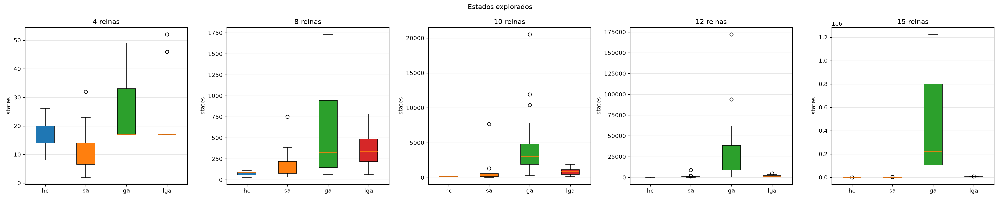
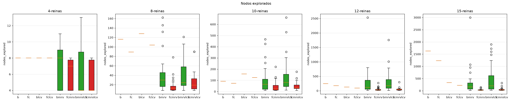
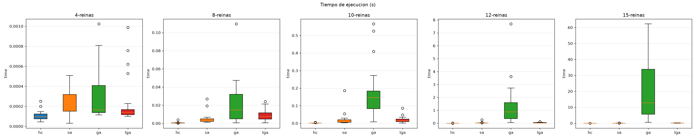
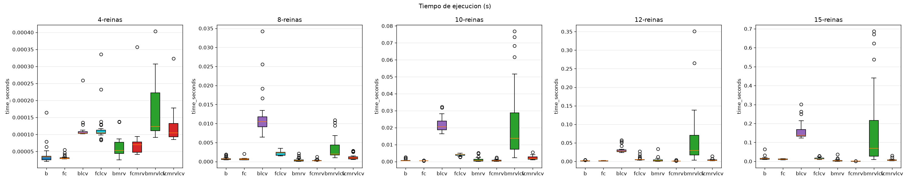

# Trabajo Práctico 5: Satisfacción de Restricciones (CSP)

## Ejercicio 1: Formulación CSP para el Sudoku

### 1. Variables ($X$)
El conjunto de variables $X$ representa cada una de las 81 celdas de la cuadrícula de $9 \times 9$:
$$X = \{ X_{i,j} \mid 1 \le i \le 9, \, 1 \le j \le 9 \}$$
donde $i$ indexa la fila (de arriba a abajo) y $j$ indexa la columna (de izquierda a derecha).

### 2. Dominios ($D$)
El dominio de cada variable representa los valores numéricos posibles que puede tomar una celda. 
Para cada celda $X_{i,j}$, su dominio $D_{i,j}$ depende de si la celda está pre-completada:
*   **Si la celda $(i,j)$ está vacía inicialmente:**
    $$D_{i,j} = \{1, 2, 3, 4, 5, 6, 7, 8, 9\}$$
*   **Si la celda $(i,j)$ está pre-completada con el valor $v$ ($v \in \{1, \dots, 9\}$):**
    $$D_{i,j} = \{v\}$$

### 3. Restricciones ($C$)

#### Formulación mediante restricciones globales ($Alldiff$)

* **Restricciones de Fila:** Para cada fila $i \in \{1, \dots, 9\}$, todos los elementos deben ser distintos:

$$Alldiff(X_{i,1}, X_{i,2}, X_{i,3}, X_{i,4}, X_{i,5}, X_{i,6}, X_{i,7}, X_{i,8}, X_{i,9})$$

* **Restricciones de Columna:** Para cada columna $j \in \{1, \dots, 9\}$, todos los elementos deben ser distintos:

$$Alldiff(X_{1,j}, X_{2,j}, X_{3,j}, X_{4,j}, X_{5,j}, X_{6,j}, X_{7,j}, X_{8,j}, X_{9,j})$$

* **Restricciones de Bloque:** Para cada bloque definido por $i, j \in \{0, 1, 2\}$, todos los elementos deben ser distintos:

$$Alldiff(\{ X_{3i+r, 3j+c} \mid r, c \in \{1, 2, 3\} \})$$

---

## Ejercicio 2: Demostración de Arco Consistencia con el algoritmo AC-3

#### Estado Inicial y Restricciones

* **Restricciones:** $$C = \{SA \neq WA, SA \neq NT, SA \neq Q, SA \neq NSW, SA \neq V, WA \neq NT, NT \neq Q, Q \neq NSW, NSW \neq V\}$$

* **Dominio Inicial**

$$\begin{aligned} D_{SA} &= \{\text{red, green, blue}\} \\ D_{WA} &= \{\text{red}\} \\ D_{NT} &= \{\text{red, green, blue}\} \\ D_{Q} &= \{\text{red, green, blue}\} \\ D_{NSW} &= \{\text{red, green, blue}\} \\ D_{V} &= \{\text{blue}\} \end{aligned}$$

Es necesario transformar cada restricción binaria simétrica (bidireccional) en dos arcos dirigidos independientes (uno en cada dirección)

* `Cola de Trabajo Inicial`

$$\begin{aligned} Queue = \{  & (SA, WA), && (WA, SA), \\ & (SA, NT), && (NT, SA), \\ & (SA, Q),  && (Q, SA), \\ & (SA, NSW),&& (NSW, SA), \\ & (SA, V),  && (V, SA), \\ & (WA, NT), && (NT, WA), \\ & (NT, Q),  && (Q, NT), \\ & (Q, NSW), && (NSW, Q), \\ & (NSW, V), && (V, NSW)  \} \end{aligned}$$

* `Traza`

>1. Desencolar $(SA, WA)$
    - Revisar $D_{SA} = \{green, blue\}$
>2. Desencolar $(SA, NT)$
>3. Desencolar $(SA, Q)$
>4. Desencolar $(SA, NSW)$
>5. Desencolar $(SA, V)$
>    - Revisar $D_{SA} = \{green\}$
>    - Encolar $(SA, WA), (SA, NT), (SA, Q), (SA, NSW)$
>6. Desencolar $(WA, NT)$
>7. Desencolar $(NT, Q)$
>8. Desencolar $(Q, NSW)$
>9. Desencolar $(NSW, V)$
>    - Revisar $D_{NSW} = \{red, green\}$
>10. Desencolar $(WA, SA)$
>11. Desencolar $(NT, SA)$
>12. Desencolar $(NT, SA)$
>    - Revisar $D_{NT} = \{red, blue\}$
>    - Encolar $(NT, Q)$
>13. Desencolar $(Q, SA)$
>    - Revisar $D_{Q} = \{red, blue\}$
>    - Encolar $(Q, NSW)$
>14. Desencolar $(NSW, SA)$
>    - Revisar $D_{NSW} = \{red\}$
>    - Encolar $(NSW, V)$
>15. Desencolar $(V, SA)$
>16. Desencolar $(NT, WA)$
>    - Revisar $D_{NT} = \{blue\}$
>    - Encolar $(NT, Q), (NT, SA)$
>17. Desencolar $(Q, NT)$
>18. Desencolar $(NSW, Q)$
>    - Revisar $D_{NSW} = \{\}$
>    - Retorno $false$

El algoritmo `AC-3` retorna `false` entonces la **Asignación Parcial:** $\{WA = red, V = blue\}$ es inconsistente.

---

### Ejercicio 3: Complejidad en el Peor Caso de AC-3 en un CSP Estructurado en Árbol

### 1. Complejidad en un Grafo General

En un CSP general con $n$ variables, dominios de tamaño máximo $d$, y $c$ restricciones binarias:
*   Cada arco dirigido $(X_i, X_j)$ puede insertarse en la cola del algoritmo AC-3 a lo sumo $d$ veces, dado que un dominio solo puede reducirse $d$ veces.
*   Cada vez que se procesa un arco de la cola, la función de revisión (`REVISE`) tiene un costo de $O(d^2)$.
*   Por tanto, la complejidad es: $O(c \cdot d^3)$

### 2. Complejidad Óptima de AC-3 sobre un Árbol

Para un CSP árbol estructurado, el número de restricciones binarias es exactamente ${c = n - 1}$

Si explotamos conscientemente la estructura de árbol, no necesitamos ejecutar el algoritmo AC-3 de propagación general iterativo En su lugar, podemos aplicar un enfoque de **Consistencia de Arco Dirigido (`DAC`)** en dos fases simples ****:

1.  **Ordenamiento Topológico:** Se elige una raíz cualquiera y se ordenan linealmente las variables del árbol de tal forma que cada variable aparezca después de su variable padre en el árbol (con un costo de $O(n)$).

2.  **Fase de Hacia Atrás (Bottom-Up):** Se hace que cada padre sea arco consistente con respecto a su hijo. Como hay $n - 1$ variables y cada revisión toma $O(d^2)$, esta fase tiene un costo de $O(nd^2)$

3.  **Fase de Hacia Adelante (Top-Down):** Se asignan los valores en orden de la raíz a las hojas Como el árbol ya es consistente de arco dirigido desde las hojas a la raíz, se garantiza que siempre habrá un valor consistente disponible para cada hijo, eliminando la necesidad de realizar backtracking. Esta fase tiene un costo de $O(nd)$.

Por lo tanto, la complejidad temporal en el peor caso para resolver un CSP estructurado en árbol de manera óptima usando consistencia de arco dirigido es $O(n \cdot d^2)$

---

## Ejercicio 5.d: Comparativa de Desempeño: CSP (TP5) vs. Búsqueda Local (TP4)

### Estados o Nodos explorados

### Tiempo (segundos) de ejecución

### 1. Formulación del Estado: Constructiva vs. Completa

Búsqueda Local utiliza una formulación de estado completo (complete-state formulation). En este enfoque, cada estado del espacio de búsqueda representa una configuración donde todas las variables tienen un valor asignado (es decir, las N reinas están colocadas simultáneamente en el tablero desde el inicio del algoritmo). El proceso de búsqueda avanza modificando incrementalmente el valor de una variable a la vez (moviendo una reina de fila dentro de su columna correspondiente) para intentar minimizar los conflictos
CSP adopta una formulación constructiva o de asignación parcial. El proceso de búsqueda comienza con una asignación vacía sin variables definidas y construye la solución paso a paso, asignando un valor a una sola variable en cada iteración.

### 2. Garantía de Solución y Completitud

Búsqueda Local solo evalúa el vecindario inmediato del estado actual para moverse hacia la mejor opción local. Son propensos a quedar atrapados en máximos locales, en consecuencia, Hill Climbing clásico falla la mayoría de las veces en encontrar la solución óptima.
Los métodos de búsqueda basados en Backtracking (y mejorados mediante técnicas como Forward Checking) son completos. Al explorar el árbol de asignaciones de manera ordenada y exhaustiva, se garantiza que el algoritmo siempre encontrará una solución válida si existe, o reportará con total certeza que el problema no tiene solución

### 3. Estados y Nodos Explorados

Si bien las formulaciones de estado son diferentes, no hay gran diferencia en la ventaja de backtracking sobre los algoritmos de búsqueda local. En esta métrica los que más estados exploran son los algoritmos genéticos, mientras que los que incorporan forward checking marcan la diferencia con la menor cantidad.

### 4. Tiempo de Ejecución y Costo por Nodo
En búsqueda local la evaluación de cada estado es sumamente veloz y directa, ya que requiere únicamente calcular la diferencia de conflictos al reubicar un elemento en su vecindario inmediato. No obstante, el tiempo total de ejecución es altamente impredecible y con una gran varianza, pues depende de la suerte en la generación de configuraciones iniciales viables y de la cantidad de reinicios requeridos para escapar de los máximos locales

Con backtracking se presenta una mayor sobrecarga computacional por cada nodo visitado debido al costo de realizar inferencias, filtrado de dominios y mantenimiento de consistencia. Sin embargo, para problemas estructurados, este costo por nodo se compensa con creces al evitar la exploración ciega, lo que se traduce en un tiempo de ejecución general sumamente bajo, predecible y eficiente.